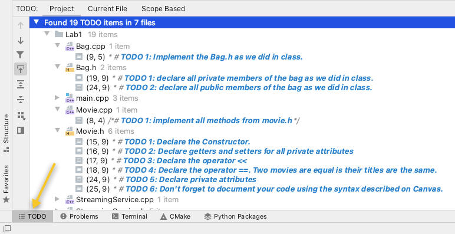
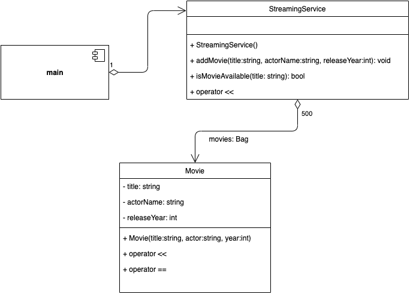

# Laboratory #1

-----
**CSCI2421 - Summer 2021**

### **_Team Members Names:_**
- Student #1: `Sourachath Dennis Rojanaphong`
- Student #2: `Lizzie Vana`
- Student #3: `n/a`

### **Lab Status**
```text
//**Describe **briefly** how complete your lab is, and how did you tested it.
Does it work on CSEGrid?**//

The lab is not complete, but we believe it is nearly complete. Thus, it has 
yet to be tested.
```

-----

## TODO:
1. Complete your and your teammates names on the top of this document.
1. Open the **TODO tab** on CLION, and complete the implementation.
1. **Document your code**, as described on Canvas.
1. All team members should be working concurrently using **code-with-me on Clion**. 
1. If you have questions, use Zoom _"Ask for help button"_ on the toolbar (bottom), and the instructors will get to 
   your room asap.
1. Please keep your camera turned on, so you can interact with your team. 
1. Instructors will be walking through the rooms regularly. 
1. Push it to GitHub
1. Pull it from git into CSEGrid
1. Compile it and run it on CSEGrid using `make`.
1. **Capture a screenshot and save it on your CLion Project folder.**
1. Complete the *Lab Status* section on this document.



### Submission
- Complete the lab.
- On CLion execute Build --> Clean from the menu (this will remove all temporary files)
- Using zip, compress the entire CLion Project and upload it to canvas before 11:35am.

## Description
- `BagInterface.h` defines the ADT Bag (_provided_)
- `Bag.h` & `Bag.cpp` implements a particular type of bag #TODO.
- `Movie.h` & `Movie.cpp` the movie class (see UML diagram below)
- `StreamingService.h` & `StreamingService.cpp` the streaming service class (see UML diagram below)
- `main.cpp` is the main program. 

## UML 


The diagram shows the main application the creates an object of `StreamingService` which represents your system.

This object will have a _bag of movies_ (private attribute) and three main methods: 
- `addMovie`: that takes the movie title, the movie main actor and the year of release. It will create the movie and 
  add it to the bag of movies.
- `isMovieAvailable`: that returns either true or false.
- the output operator `<<`. See the output below. 

Each movie has three private attributes: `title`, `actorName` and `releaseYear`.
In addition to the **getters and setters**
the movie has a _customized constructor_ and redefines the output operator `<<` and the equality operator `==`. 
Two movies are equal is their titles match.

## Object Outputs

## StreamingService Output
This is the output when you execute `cout<< aStreamingServiceObj;`
```text
Movies in the Streaming Service: 
>>Harry Potter and the Philosopher's Stone--Daniel Radcliffe--2001<<
>>Harry Potter and the Chamber of Secrets--Daniel Radcliffe--2002<<
>>Harry Potter and the Prisoner of Azkaban--Daniel Radcliffe--2004<<
>>Harry Potter and the Goblet of Fire--Daniel Radcliffe--2005<<
>>Harry Potter and the Order of the Phoenix--Daniel Radcliffe--2007<<
--------------------------------------------
```


## Movie Output
This is the output when you execute `cout<< aMovie;`
```text
>>Harry Potter and the Philosopher's Stone--Daniel Radcliffe--2001<<
```

## Main Program
The main program loads the predefined data (the one shown see [StreamingService Output](#streamingservice-output) above)
and displays a menu as it opens with 4 options:
1. Display the movies in the streaming service.
   - Will just print the StreamingService object.
1. Add new movie to the system
   - Will ask for the movie title, main author and release year. 
   - Will add the movie to the Streaming Service.  
1. Check movie availability
    - asks the user for a movie title and if the movie is in the system it will print it out 
    - otherwise, will tell the user that the movie is not there.
1. Exit the application.

The application will continue showing the menu after the user executes some action until he/she selects 
"exit the application" option.

 